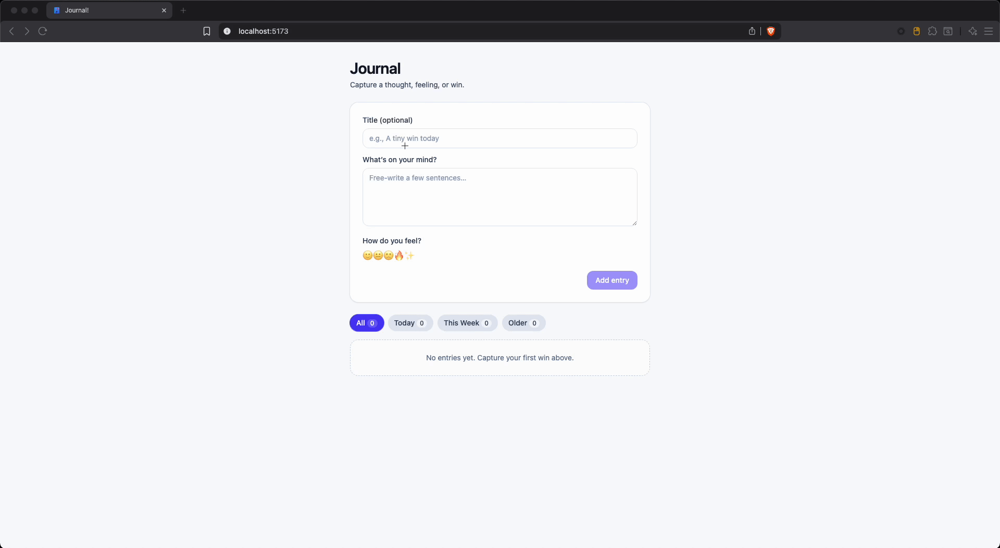

# 🪶 Journal App

Minimal daily journaling app built with React + Tailwind CSS.


> ✨ A simple place to capture thoughts, wins, or reflections.

---

## 🚀 Features

- 🖋️ Add journal entries with title & content
- 💾 Auto-save to local storage
- 🧹 Delete or edit entries
- 🪶 Clean light UI (Tailwind)
- 💾 Local Persistence
- Data Shape Cleanup

---

## 🖼 Preview

### Main App



---

## 🛠 Tech Stack

- **React + Vite** — fast dev setup
- **TypeScript** — type safety
- **Tailwind CSS** — utility-first styling
- **LocalStorage** — client-side persistence

---

## 📦 Getting Started

1. 📥 Clone repo

```bash
git clone https://github.com/yourname/journal-app
```

2. 📂 Enter folder

```bash
cd App/Journal
```

3. 📦 Install dependencies

```bash
npm install
```

4. 🚀 Start dev server

```bash
npm run dev
```

5.  👉 In your browser, visit [http://localhost:5173](http://localhost:5173)

---

## 📂 Project Structure

<details>
<summary>📁 Click to expand project file structure</summary>

```plaintext
├── .gitignore
├── eslint.config.js
├── index.html
├── package-lock.json
├── package.json
├── public
│   ├── .DS_Store
│   ├── app.gif
│   └── assets
│       └── icon.svg
├── README.md
├── Screenshots
├── src
│   └── app
│       ├── App.tsx
│       ├── components
│       │   ├── FilterBar.tsx
│       │   ├── JournalEntryCard.tsx
│       │   ├── JournalForm.tsx
│       │   └── JournalList.tsx
│       ├── hooks
│       │   └── useJournal.ts
│       ├── lib
│       │   ├── date.ts
│       │   └── types.ts
│       ├── main.tsx
│       ├── pages
│       │   ├── JournalPage.tsx
│       │   └── StatsPage.tsx
│       ├── styles
│       │   └── global.css
│       └── types
│           └── types.ts
├── tsconfig.app.json
├── tsconfig.app.tsbuildinfo
├── tsconfig.json
├── tsconfig.node.json
├── vite-env.d.ts
└── vite.config.ts
```

</details>

---

## 🧭 Usage

Once the app is running locally (`npm run dev`):

1. **Add a new entry**
   - Type a short **title** (optional) and your **thoughts** in the form.
   - Click **Add entry** to save.
   - Entries are stored automatically in your browser’s `localStorage`.

2. **View your journal**
   - Each entry appears immediately below the form.
   - Entries show their **timestamp**, **title**, and **content**.

3. **Delete an entry**
   - Click the **Delete** link at the bottom of an entry card.
   - The entry disappears instantly (and is removed from local storage).

4. **Persistence**
   - Refreshing the page reloads all your saved entries.
   - Data lives only in your browser — no backend required.

---

🏗 Built For Learning

This project is a small practice app to learn how to combine:

- React + TypeScript for type-safe UI development
- Tailwind v4 styling with Vite plugin
- State management with React hooks
- Small **UX touches** (undo, confetti, animations) that make an app feel polished

---

## 🙋‍♂️ About the Author

Built with 💻 by [Nicholas Clark](https://www.linkedin.com/in/nickdoesdevops)

Follow the journey: #NickDoesDevOps

🧠 #NickDoesDevOps | 🚀 #LearningInPublic | 🔧 #WorldDomination

## 📄 License

MIT
